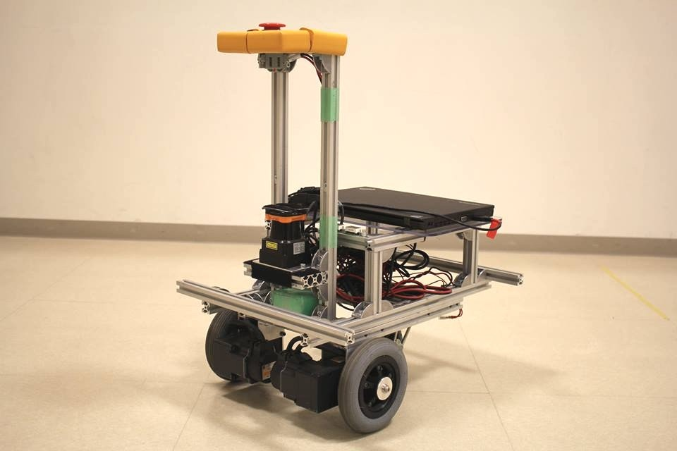

orne_navigation
=================

[](https://gitter.im/open-rdc/orne_navigation?utm_source=badge&utm_medium=badge&utm_campaign=pr-badge&utm_content=badge)

This repository provides mobile navigation system with i-Cart mini for Tsukuba Challenge under Project ORNE. 

[](https://waffle.io/open-rdc/tsukubachallenge/metrics) 



## Dependency Repositories

* https://github.com/open-rdc/icart_mini

* https://github.com/open-rdc/cit_adis_imu

* https://github.com/open-rdc/orne_maps

* https://github.com/open-rdc/orne_icart_designs

* https://github.com/DaikiMaekawa/fulanghua_navigation

* https://github.com/DaikiMaekawa/ypspur

## Install

Install ROS software (recommended ROS indigo version with Ubuntu 14.04LTS) at http://www.ros.org/wiki/ROS/Installation, please select Ubuntu platform.

```sh
$ cd CATKIN_WORKSPACE/src
$ git clone https://github.com/DaikiMaekawa/ypspur.git
$ catkin build ypspur
$ wstool init
$ wstool merge https://raw.githubusercontent.com/open-rdc/orne_navigation/indigo-devel/orne_pkgs.install
$ wstool up
$ rosdep install --from-paths . --ignore-src --rosdistro $ROS_DISTRO -y
$ catkin build
```

## Usage

### Bring up the real/simulated robot

The following will show the commands needed to bring up either real or simulated robots.

* Bring up the simulated robot

```sh
$ roslaunch orne_bringup orne_alpha_sim.launch // or orne_beta_sim.launch
```

* Bring up the real robot

```sh
$ roslaunch orne_bringup orne_alpha.launch // or orne_beta.launch
```

### Build map

```sh
$ roslaunch orne_navigation_executor  build_map_teleop.launch
```

During building a map, waypoints are recorded by pressing the No.1 button of the joystick.

When you set 2DNavGoal at the goal point on the RViz, waypoints will be saved and then waypoints file stored in orne_navigation/waypoints_cfg/waypoints.yaml is overwritten. So that, the navigation system can be automatically load waypoints configuration.

If you want to save a map, run a map_saver node like the following command.

```sh
$ rosrun map_server map_saver -f filename
```

### Record the waypoints

* Using the PublishPoint message on the RViz

```sh
$ roslaunch orne_navigation_executor  record_waypoints_viz.launch map_file:=filename.yaml
```

* Using a joystick

```sh
$ roslaunch orne_navigation_executor  record_waypoints_joy.launch map_file:=filename.yaml
```

Note that filename must be specified in the full path.

### Navigation

* Waypoint Navigation

```sh
$ roslaunch orne_navigation_executor  play_waypoints_nav.launch
```

* Waypoint Navigation with an optional map file

```sh
$ roslaunch orne_navigation_executor  play_waypoints_nav.launch map_file:=filename.yaml
```

A map name must be specified in the full path.

* Enable the starting flag

Click "StartWaypointsNavigation" button on Rviz

* Run the navigation system with a static map

```sh
$ roslaunch orne_navigation_executor  nav_static_map.launch
```

Don't forget to turn off the teleoperation, it might interfere with the robot's commands.

## Bugs & Tasks

https://github.com/open-rdc/orne_navigation/issues

## License


Copyright (c) 2014 - 2015, [Daiki Maekawa](https://github.com/DaikiMaekawa) and Chiba Institute of Technology.

License-check is open source software under the [BSD license](https://github.com/open-rdc/icart_mini_ros_pkgs/blob/master/LICENSE).
